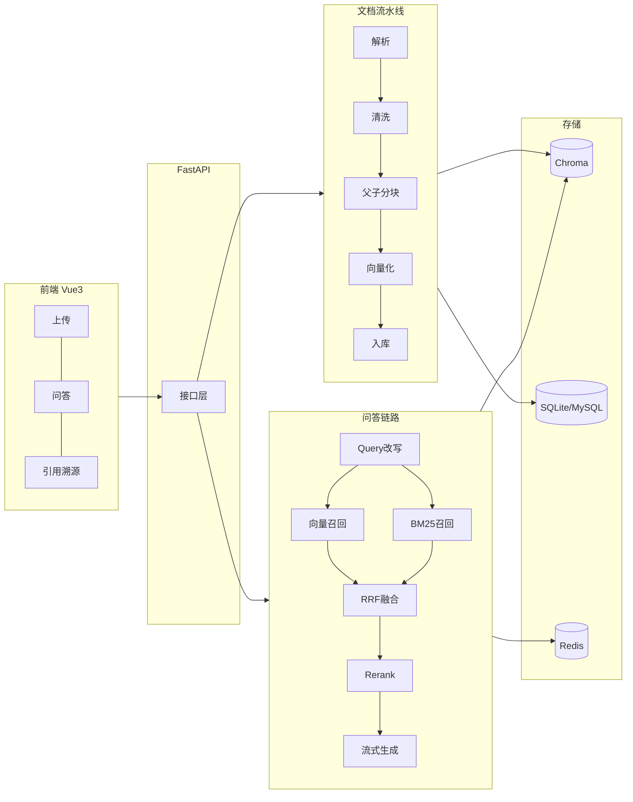

<div align="center">

# DocMind

**基于混合检索与引用溯源的私有文档智能问答系统**

上传 PDF → 自动解析分块 → 向量化入库 → 自然语言提问 → **带原文页码引用的答案**

[](https://www.python.org/)
[](https://fastapi.tiangolo.com/)
[](https://vuejs.org/)
[](https://www.trychroma.com/)
[](LICENSE)

</div>

---

## 解决什么问题

团队内部沉淀了大量 PDF 文档（产品手册、测试规范、设备说明、制度文件），
员工遇到问题时只能靠关键词搜索或翻页查找 —— 慢，且容易漏。

DocMind 让你**直接对着文档提问**，系统基于文档原文作答，
并标注答案出自**哪一页的哪一段**，可点击跳转核对。

> 与"把文档丢给大模型让它总结"的区别：
> 答案是**检索出来的**，不是模型凭记忆编的；且**每句话都能溯源**。

---

## 核心特性

| 特性 | 说明 |
|---|---|
| 🔍 **混合检索** | 向量语义召回 + BM25 关键词召回，RRF 融合。解决纯向量对**型号/数字/专有名词**不敏感的问题 |
| 🧩 **父子块索引** | 子块（300 字）建索引保检索精度，父块（1500 字）喂模型保上下文完整。Small-to-Big 策略 |
| 🎯 **Cross-Encoder 精排** | 双塔召回 + 交叉编码器精排，20 → 5 的精度跃迁 |
| 📌 **引用溯源** | 答案标注 `[1][2]`，**服务端校验引用编号真实性**，点击定位到 PDF 页码 |
| 🛡️ **四道防幻觉防线** | 精排分数阈值拒答 → Prompt 约束 → 结构化输出 → 服务端引用校验 |
| ⚡ **异步文档流水线** | 上传立即返回，后台解析入库，状态机驱动（PENDING/PARSING/EMBEDDING/READY/FAILED） |
| 🔁 **幂等上传** | 文件内容 MD5 去重，重复上传秒传，不产生重复向量 |
| 💬 **多轮对话** | Query 改写解决代词指代漂移（"那它的寿命呢？"） |
| 🔐 **多用户隔离** | `user_id` 过滤条件下沉到向量库，而非应用层事后过滤 |
| 📊 **分层评测体系** | Golden Set + 检索层/生成层分离指标，优化有数据支撑而非凭感觉 |

---

## 架构总览



详细设计见 [`docs/01-架构设计.md`](docs/01-架构设计.md)。

---

## 快速开始

### 前置要求

- Python **3.11+**
- 一个 LLM API Key（默认对接 [DeepSeek](https://platform.deepseek.com/)，兼容任意 OpenAI 协议服务）

### 三步启动

```bash
# 1. 安装依赖（国内建议加镜像）
pip install -r requirements.txt -i https://pypi.tuna.tsinghua.edu.cn/simple

# 2. 配置环境变量
cp .env.example .env          # Windows: copy .env.example .env
#    然后编辑 .env，填入 DOCMIND_LLM_API_KEY
#    国内网络请保留 HF_ENDPOINT=https://hf-mirror.com 以加速模型下载

# 3. 环境自检 + 启动
python backend/scripts/check_env.py
cd backend && python -m uvicorn app.main:app --reload
```

打开 http://127.0.0.1:8000/docs 查看交互式 API 文档。

> **Windows 用户**：直接双击根目录的 `run-backend.cmd` 即可。

### 验证服务状态

```bash
# 存活探针
curl http://127.0.0.1:8000/api/v1/health

# 就绪探针 —— 逐项检查 6 个依赖的可用性
curl http://127.0.0.1:8000/api/v1/health/ready
```

就绪探针会告诉你**具体哪一项没准备好**（模型没装？Key 没配？目录不可写？），
而不是笼统地返回一个失败。

---

## 技术栈

| 层次 | 选型 | 理由 |
|---|---|---|
| Web 框架 | FastAPI | 原生 async，SSE 流式友好，Pydantic 自动文档化 |
| 向量库 | Chroma（embedded） | 零部署成本，原生支持元数据过滤。已抽象接口可切 Milvus |
| Embedding | BAAI/bge-small-zh-v1.5（本地） | 中文效果好，CPU 可跑，无数据出域风险 |
| Rerank | BAAI/bge-reranker-base（本地） | 交叉编码器精排，精度提升性价比最高的一环 |
| 关键词检索 | jieba + BM25 | 补齐向量对型号/数字的短板 |
| LLM | DeepSeek（OpenAI 兼容） | 改 `.env` 即可切换任意厂商，代码零改动 |
| 向量/关系存储 | Chroma + SQLite/MySQL | 开发零依赖，生产可平滑切换 |
| 任务队列 | RQ + Redis | 比 Celery 更贴合本项目规模；`inline` 模式下无需 Redis |

完整选型对比与放弃理由见 [`docs/02-技术选型与权衡.md`](docs/02-技术选型与权衡.md)。

---

## 项目结构

```
docmind/
├── backend/
│   ├── app/
│   │   ├── main.py               应用工厂 / 生命周期 / 全局异常
│   │   ├── static/index.html     零依赖 Web 控制台（单文件，无需构建）
│   │   ├── core/                 配置 · 日志 · 异常 · 响应 · 中间件
│   │   ├── api/v1/               HTTP 接口（health / documents / chat / settings）
│   │   ├── models/               SQLAlchemy ORM
│   │   ├── schemas/              Pydantic 请求/响应模型
│   │   ├── services/
│   │   │   ├── parser/           PDF 解析与清洗
│   │   │   ├── chunking/         父子块切分
│   │   │   ├── embedding/        向量化（本地 BGE / 云端 API 可切换）
│   │   │   ├── vectorstore/      向量库（Chroma 封装）
│   │   │   ├── retrieval/        混合检索 + RRF + 精排
│   │   │   ├── llm/              LLM 客户端（OpenAI 兼容，支持流式）
│   │   │   ├── rag/              RAG 编排 + 引用校验
│   │   │   ├── ingest.py         入库编排
│   │   │   ├── document_service.py  文档业务逻辑
│   │   │   └── config_service.py    运行时配置
│   │   └── db/                   异步会话与引擎
│   ├── tests/                    131 个测试
│   ├── scripts/                  环境自检 / 解析质量检查
│   └── Dockerfile
├── docs/                         设计文档
├── docker-compose.yml            chroma + redis + backend + worker
└── .env.example
```

---

## 开发进度

| 阶段 | 内容 | 状态 |
|---|---|---|
| P0 | 项目骨架（配置/日志/异常/探针/自检） | ✅ 已完成 |
| P1 | 文档入库链路（解析→分块→向量化→入库） | ✅ 已完成 |
| P2 | 问答链路（混合检索→精排→流式生成→引用） | ✅ 已完成 |
| P3 | 多轮对话与 Query 改写 | ⏳ |
| P4 | 工程化加固（异步/幂等/缓存/隔离） | ⏳ |
| P5 | 评测体系与量化对比实验 | ⏳ |
| P6 | 前端界面 | ⏳ |

详见 [`docs/04-开发路线图.md`](docs/04-开发路线图.md)。

### 实测数据（真实 PDF，GPU 向量化）

| 指标 | 数值 |
|---|---|
| 解析 2 页 PDF（含坐标/分栏/页眉页脚处理） | 1585 ms |
| 向量化 16 个子块（RTX 4060） | 289 ms |
| 端到端入库 | 3.7 s |
| 产出 | 7 个父块 + 16 个子块 |

### 文档接口

| 方法 | 路径 | 说明 |
|---|---|---|
| POST | `/api/v1/documents` | 上传 PDF（内容 MD5 幂等） |
| GET | `/api/v1/documents` | 分页列表（支持状态筛选） |
| GET | `/api/v1/documents/{id}` | 文档详情 |
| GET | `/api/v1/documents/{id}/status` | 精简状态（供前端轮询） |
| POST | `/api/v1/documents/{id}/reindex` | 重新处理 |
| DELETE | `/api/v1/documents/{id}` | 删除（软删 + 清向量 + 删文件） |

解析质量检查工具（换新文档时先跑一遍，10 秒看出解析/分块是否正常）：

```bash
python backend/scripts/parse_pdf.py "你的文档.pdf" --show-chunks 3
```

---

## 设计文档

| 文档 | 内容 |
|---|---|
| [01-架构设计](docs/01-架构设计.md) | 整体架构、核心数据流、关键设计取舍 |
| [02-技术选型与权衡](docs/02-技术选型与权衡.md) | 每个选型对比了什么、放弃了什么、代价是什么 |
| [03-难点与踩坑记录](docs/03-难点与踩坑记录.md) | 真实难点的现象/根因/方案/验证方法 |
| [04-开发路线图](docs/04-开发路线图.md) | 分阶段交付计划与验收标准 |
| [05-P0代码精讲](docs/05-P0代码精讲.md) | 逐文件讲解 P0 骨架与 15 道自测题 |

---

## 开发

```bash
# 运行测试
python -m pytest

# 代码检查与格式化
ruff check . --fix
ruff format .

# 类型检查
mypy backend
```

---

## License

[MIT](LICENSE)
