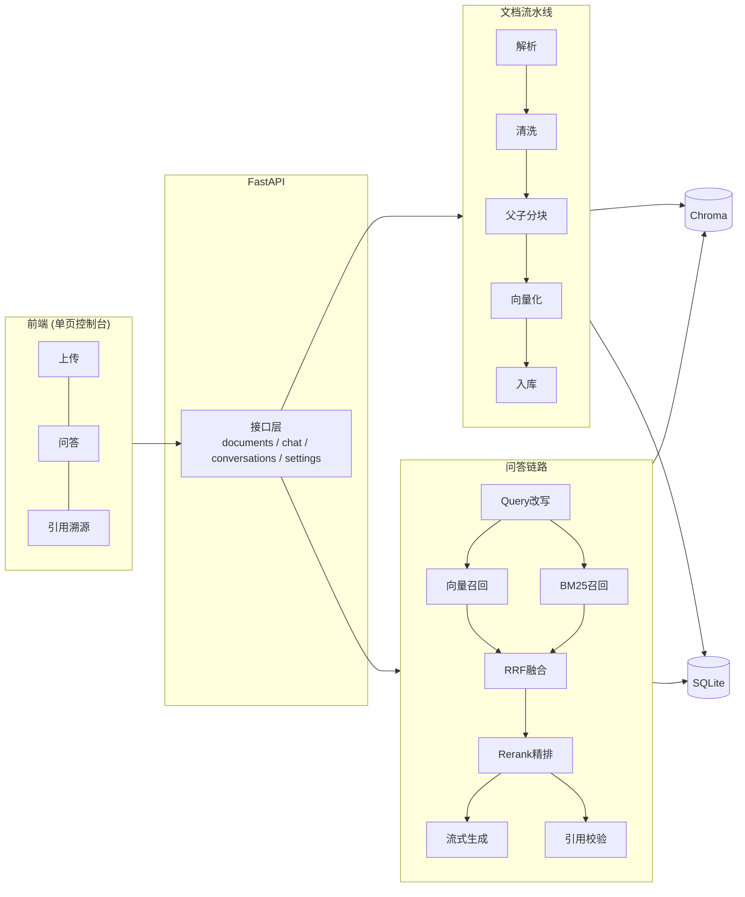

<div align="center">

# DocMind

**上传 PDF，用自然语言提问，得到带原文页码引用的答案**

不只是"接个大模型" —— 完整的文档解析、父子块索引、混合检索、重排、
引用溯源与量化评测。

[](https://www.python.org/)
[](https://fastapi.tiangolo.com/)
[](#开发)
[](LICENSE)

</div>

---

## 30 秒了解

> 团队内部的 PDF 文档（产品手册、测试规范、设备说明）越堆越多，
> 想查个参数只能靠关键词搜索或翻页。DocMind 让你**直接对着文档提问**，
> 答案标注出自**哪一页的哪一段**，可点击跳转核对。

与"把文档丢给大模型让它总结"的区别：**答案是检索出来的，不是模型凭记忆编的**，
而且每句话都能溯源。

### 它能做什么

| 能力 | 说明 |
|---|---|
| 📄 **PDF 解析** | 保留坐标与页码 → 自动识别页眉页脚、还原双栏排版、识别章节标题 |
| 🧩 **父子块索引** | 子块（300 字）检索保精度，父块（1500 字）喂模型保完整 |
| 🔍 **混合检索** | 向量语义 + BM25 关键词 + RRF 融合 + Cross-Encoder 精排 |
| 📌 **引用溯源** | 答案标注 `[1][2]`，**服务端校验编号真实性**，点击跳到原文 |
| 🔧 **分块可视化调参** | 网页上改分块参数，**毫秒级看到切成什么样**，满意再应用 |
| 💬 **对话历史** | 服务端持久化，刷新不丢，可重命名、搜索、续聊 |
| ⚙️ **网页配置** | API Key、模型、检索参数全部在网页上改，**保存即生效不用重启** |
| 📊 **量化评测** | Golden Set + Recall@K / MRR / 拒答率，参数对比有数据支撑 |
| 🎤 **模拟面试 Agent** | 上传简历 → 勾选 SKILL → 面试官主动提问、**按回答质量动态追问**、最后出复盘报告 |

---

## 快速开始

### 前置要求

- **Python 3.11 或更高版本**（[下载](https://www.python.org/downloads/)，安装时勾选 *Add Python to PATH*）
- 一个大模型 API Key（默认对接 [DeepSeek](https://platform.deepseek.com)，兼容任意 OpenAI 协议服务）

> ### 💡 不需要安装数据库
>
> | 组件 | 是否需要装 |
> |---|---|
> | 关系库（SQLite） | ❌ Python 标准库自带 |
> | 向量库（Chroma） | ❌ 随 pip 包装好，内嵌在应用进程里 |
> | Redis | ❌ 只有开启任务队列模式才需要，默认不用 |
> | Docker | ❌ 只有要水平扩容才需要 |
>
> **装完 Python 依赖就能跑。**

### 三步启动

<table>
<tr><th>Windows</th><th>Linux / macOS</th></tr>
<tr><td>

```bat
:: 1. 双击运行
install.bat

:: 2. 在打开的 .env 里填入 API Key
::    DOCMIND_LLM_API_KEY=sk-xxxxxxxx

:: 3. 双击运行
start.bat
```

</td><td>

```bash
# 1. 安装
./install.sh

# 2. 填入 API Key
vim .env
#    DOCMIND_LLM_API_KEY=sk-xxxxxxxx

# 3. 启动
./start.sh
```

</td></tr>
</table>

启动脚本会自动：检查 Python 版本 → 装依赖（国内自动走镜像）→ 创建 `.env`
→ 环境自检 → 启动服务 → 打开浏览器。

> ⏱️ **首次启动需要 1~3 分钟**：要下载约 95MB 的向量模型并预热。
> 在这之前浏览器打不开是正常的，脚本会等服务真正就绪后再打开页面，
> 终端里也会打印明确的「DocMind 已就绪」。

### 立即体验

启动后浏览器会自动打开 `http://127.0.0.1:8000`。

**没有 PDF 可以试？** 项目自带一份示例文档：

```
samples/NX-3000设备维护手册-示例.pdf     8 页，6 个章节，含型号与参数
```

把它拖进上传区 → 等状态变「已就绪」→ 切到「智能问答」提问，比如：

- `钢刀的更换周期是多少？`
- `锡膏储存温度要求是多少？`
- `NX3K-BL-200 和 NX3K-BL-200H 有什么区别？`

**想试「模拟面试」？** 项目还自带一份刻意留了"槽点"的示例简历：

```
samples/张明-后端开发-示例简历.pdf     1 页，含可追问的数字、选型与模糊表述
```

上传它 → 切到「模拟面试」→ 勾选 `技术面试官` + `项目经历深挖` → 开始面试。

> 这份简历不是随便写的：里面有「提升 40%」没说测量口径、「独立完成全栈」与实习
> 「负责后端」的矛盾、以及「学习能力强」这类没有证据的大词 —— **这些才是面试官
> 该追问的地方**。用一份说明书去面试是问不出东西的。

需要重新生成示例文件：

```bash
python scripts/make_sample_doc.py       # 问答用的设备手册
python scripts/make_sample_resume.py    # 面试用的简历
```

---

## 界面

> 📷 **截图位置**：在 `docs/images/` 下放三张截图，然后把下面这行替换掉。
> 建议截：① 文档管理页 ② 问答页（含引用卡片）③ 分块调参抽屉

<!-- 替换为实际截图：


-->

界面共四个页签：

| 页签 | 内容 |
|---|---|
| **文档管理** | 拖拽上传、处理状态、父子块统计、解析/向量化耗时、重新处理、删除 |
| **智能问答** | 左侧会话历史（可重命名/搜索/续聊），右侧流式问答与可点击的引用卡片 |
| **模拟面试** | 勾选 SKILL + 选简历 → 面试官主动提问、动态追问、复盘报告 |
| **设置** | API Key、模型、检索参数、分块策略，**保存即生效** |

---

## 模拟面试 Agent

这是项目里**唯一一个「Agent 主动」的功能** —— 问答是你问它答，面试是它问你答。

### 和问答链路的区别

| | 智能问答 | 模拟面试 |
|---|---|---|
| 谁主动 | 用户 | **Agent** |
| 文档注入 | 检索 Top-K 片段 | **简历全文注入** |
| 状态 | 基本无状态 | **强状态**（提纲 / 追问层级 / 轮次） |
| 追问 | 无 | **按回答质量的动态决策** |

**为什么简历不走检索？** 面试官需要的是**全局视角** —— 发现"实习写负责后端、
项目又写独立完成全栈"这种前后矛盾，判断技术栈演进，规划提问顺序。这些 Top-K
检索做不到。同一份文档，问答要的是精确片段，面试要的是整体理解 ——
**任务不同，注入策略就该不同**。

### SKILL：用文件定义面试风格

面试风格写在 `skills/` 目录下的 Markdown 文件里，前端勾选（最多 2 个）：

```
skills/
├── README.md                  SKILL 编写规范
├── technical-interviewer/
│   └── SKILL.md               技术面试官：量化来源 / 选型取舍 / 实现深度 / 失败经验
└── project-deep-dive/
    └── SKILL.md               项目深挖：STAR 反向拆解 + 四层提问路径
```

SKILL 是**两层结构**，这是刻意的设计：

```markdown
---
id: technical-interviewer
name: 技术面试官
max_follow_up: 3          # ← 这些字段由「代码」读取
max_turns: 25
---

# 角色                     # ← 从这里往下由「模型」阅读
你是一位有十年经验的技术面试官……
```

- **结构化字段交给代码**：`max_follow_up` / `max_turns` 必须被真正执行，
  否则就是一句没人听的建议 —— 这和项目里「引用编号服务端校验」是同一个道理。
- **正文交给模型**：提问维度、追问规则表这些是风格描述，模型读得懂就行。

勾选多个 SKILL 时，正文拼接（第一个为主），**约束取更严格值**（min / 任一为真）——
安全约束只能收紧，不能放宽。

改完 SKILL.md，点界面上的「重新扫描 SKILL」即可生效，不用重启。

### 决策在代码里，不在模型手里

模型只负责**评估回答质量**并输出结构化 JSON；**是否追问由代码决定**：

```python
if depth >= max_follow_up:          return "NEXT_TOPIC"   # 硬约束优先
if answer_depth == "deep" and has_tradeoff: return "NEXT_TOPIC"   # 答到位了就别为难人
if answer_depth == "shallow" or vague_words: return "FOLLOW_UP"
```

三个刻意的决定：

1. **硬约束优先于质量判断** —— 答得再浅，追问层级到顶也必须换话题。
2. **答得好就换题** —— 把已经答对的人继续往死里问，得到的是噪声不是信号。
3. **不给模型看分数** —— 只说"这个回答偏浅、出现了模糊词"，不说 `specificity=0.37`，
   否则模型会过度解读数字。

### 问题可溯源性校验

和 RAG 的引用校验同构，只是校验对象从「答案」换成了「问题」：

> 简历里写 MySQL，模型却顺口问"你们 Redis 集群怎么做的" ——
> 在真实面试里这是**致命错误**，候选人立刻知道面试官没看简历。

服务端会抽取问题里的技术名词（`Redis` / `QPS` / `C++` 这类高信号词），
在简历里逐个查找，找不到就在界面上标黄「简历未提及」。

**宁可漏报也不误报**：每个问题都被标黄，标记就没人看了。所以中文常用词
和 `why` / `choose` 这类通用英文词一律不查。

---

## 常见问题

<details>
<summary><b>启动后浏览器打不开 / 显示"无法连接后端"</b></summary>

首次启动要预热本地模型（1~3 分钟），这期间端口还没开始接受连接。
看终端，出现下面这段就是好了：

```
  DocMind 已就绪, 可以访问以下地址:
    Web 控制台  http://127.0.0.1:8000/
```

如果超过 5 分钟还没好，多半是模型下载慢。`.env` 里的
`HF_ENDPOINT=https://hf-mirror.com` 已经默认配好，也可以手动设置环境变量。

</details>

<details>
<summary><b>模型下载失败</b></summary>

国内网络访问 HuggingFace 经常超时。项目默认已配国内镜像：

```bash
HF_ENDPOINT=https://hf-mirror.com
```

如果还是失败，可以手动下载模型放到 HuggingFace 缓存目录，
或者先启动服务（禁用预热）再慢慢下：

```bash
DOCMIND_WARMUP_ON_STARTUP=false python scripts/start.py
```

</details>

<details>
<summary><b>问答报「未配置大模型 API Key」</b></summary>

两种配法，任选其一：

1. 编辑 `.env`，填 `DOCMIND_LLM_API_KEY=sk-xxxxxxxx`，重启服务
2. **启动后打开网页 → 「设置」页签 → 填 API Key → 保存**（立即生效，不用重启）

注意：**文档上传、分块预览不需要 Key**，只有问答需要。

</details>

<details>
<summary><b>端口 8000 被占用</b></summary>

启动脚本会检测并询问是否换端口。也可以直接指定：

```bash
python scripts/start.py --port 8001
```

</details>

<details>
<summary><b>安装依赖很慢 / 失败</b></summary>

主要耗时在 PyTorch（约 1~2 GB）。安装脚本默认走清华镜像。如果失败：

```bash
pip install -r requirements.txt -i https://pypi.tuna.tsinghua.edu.cn/simple
```

没有 NVIDIA 显卡的话，可以装 CPU 版 torch 省掉大量下载：

```bash
pip install torch --index-url https://download.pytorch.org/whl/cpu
pip install -r requirements.txt
```

</details>

<details>
<summary><b>上传 PDF 后提示「检测到扫描件」</b></summary>

扫描件是纯图片，没有文本层。当前版本未内置 OCR（PaddleOCR 会给所有用户
增加约 2GB 依赖，而 90% 的电子版 PDF 用不上），所以直接给出明确提示而不是
静默返回空结果。

需要处理扫描件的话，可以先用 [OCRmyPDF](https://github.com/ocrmypdf/OCRmyPDF)
加一层文本再上传。

</details>

<details>
<summary><b>支持哪些大模型？</b></summary>

任何**遵循 OpenAI 兼容协议**的服务，在「设置」里改两个字段即可：

| 服务商 | API 地址 | 模型名称 |
|---|---|---|
| DeepSeek | `https://api.deepseek.com/v1` | `deepseek-chat` |
| 通义千问 | `https://dashscope.aliyuncs.com/compatible-mode/v1` | `qwen-plus` |
| 硅基流动 | `https://api.siliconflow.cn/v1` | `Qwen/Qwen2.5-7B-Instruct` |
| OpenAI | `https://api.openai.com/v1` | `gpt-4o-mini` |

</details>

---

## 技术栈

| 层次 | 选型 | 为什么 |
|---|---|---|
| Web 框架 | **FastAPI** | 原生 async，SSE 流式友好，Pydantic 自动文档化 |
| 向量库 | **Chroma** | 零部署成本，原生支持元数据过滤；已抽象接口可换 Milvus |
| 向量化 | **bge-small-zh**（本地） | 中文效果好，CPU 可跑，**数据不出域**；可切云端 API |
| 重排 | **bge-reranker-base**（本地） | Cross-Encoder 精排，精度提升性价比最高的一环 |
| 关键词检索 | **jieba + BM25** | 补齐向量对型号/数字的短板 |
| 大模型 | **DeepSeek**（可换） | OpenAI 兼容协议，改 `.env` 即切换 |
| 前端 | **单文件 HTML** | 零依赖零构建，`clone` 下来就能用 |

---

## 架构



**一个请求的完整链路**（文档入库）：

```
PDF → 坐标解析(保留页码) → 去页眉页脚 → 断行合并 → 章节感知的分块
    → 子块向量化 → 写入 Chroma(带元数据) → 状态置 READY
```

详细设计见 [`docs/01-架构设计.md`](docs/01-架构设计.md)。

---

## 实测数据

> 以下都是**跑出来的真实数字**，不是估算。复现命令见
> [`eval/README.md`](eval/README.md) 与 [`backend/scripts/bench_large_pdf.py`](backend/scripts/bench_large_pdf.py)。

### 文档入库（2 页真实简历，RTX 4060）

| 环节 | 耗时 |
|---|---|
| 解析（坐标 + 分栏 + 页眉页脚 + 标题识别） | 1.59 s |
| 父子分块（7 父块 / 16 子块） | 1 ms |
| 向量化（16 子块，GPU） | 0.29 s |
| **端到端** | **3.7 s** |

### 分块策略对比（46 条评测集）

| 策略 | 父块 | 子块 | Recall@5 | **MRR** | 检索 P95 |
|---|---|---|---|---|---|
| 固定长度（基线） | 3 | 12 | 1.000 | 0.902 | 104 ms |
| 递归字符切分 | 2 | 47 | 1.000 | 0.951 | 78 ms |
| 父子块 child=150 | 7 | 32 | 1.000 | 0.959 | 182 ms |
| **父子块 child=300** | 7 | 16 | 1.000 | **0.988** | 102 ms |
| 父子块 child=500 | 7 | 11 | 1.000 | 0.957 | 130 ms |
| 关闭精排 | 7 | 16 | 1.000 | 0.929 | **13 ms** |

### 链路消融：每一步值多少

| 阶段 | Recall@5 | MRR | 增量 |
|---|---|---|---|
| ① 纯向量召回〔基线〕 | 1.000 | 0.929 | — |
| ② 纯关键词召回〔基线〕 | 0.927 | 0.809 | — |
| ③ +RRF 融合 | 0.951 | 0.909 | — |
| ④ +父块去重 | 0.976 | 0.904 | -0.005 |
| ⑤ **+Cross-Encoder 精排** | 0.976 | **0.963** | **+0.059** |
| ⑥ +父块扩展入 Prompt | **1.000** | **0.988** | +0.024 |

### 大文档吞吐

| 文档类型 | 每页解析 | 1000 页预估 |
|---|---|---|
| 内置字体 | 5 ms | 18 s |
| **Type3 逐字嵌入字体** | **681 ms** | **11.3 分钟** |

> 解析耗时与**字体嵌入方式**的相关性，远强于与页数的相关性 —— 差 136 倍。
> 详见 [`docs/07-大文档处理方案.md`](docs/07-大文档处理方案.md)。

---

## 项目结构

```
docmind/
├── install.bat / install.sh       一键安装
├── start.bat  / start.sh          一键启动
├── scripts/                       安装/启动脚本(逻辑在这里, bat 只是启动器)
├── backend/
│   ├── app/
│   │   ├── main.py                应用工厂 / 生命周期 / 全局异常
│   │   ├── static/index.html      前端控制台(单文件, 零构建)
│   │   ├── core/                  配置 · 日志 · 异常 · 响应 · 中间件
│   │   ├── api/v1/                health / documents / chat / conversations / skills / interview / settings
│   │   ├── models/                ORM 模型
│   │   ├── services/
│   │   │   ├── parser/            PDF 解析与清洗
│   │   │   ├── chunking/          父子块 / 递归 / 固定长度三种策略
│   │   │   ├── embedding/         本地 BGE / 云端 API 可切换
│   │   │   ├── vectorstore/       Chroma 封装
│   │   │   ├── retrieval/         混合检索 + RRF + 精排
│   │   │   ├── llm/               OpenAI 兼容客户端(流式)
│   │   │   ├── rag/               编排 + 引用校验
│   │   │   ├── skills/            SKILL 加载/解析/组合
│   │   │   ├── interview/         面试官 Agent(提纲/决策/可溯源校验)
│   │   │   └── config_service.py  运行时配置
│   │   └── db/                    异步会话与引擎
│   ├── tests/                     250 个测试
│   └── scripts/                   环境自检 / 解析质量检查 / 大文档压测 / 面试链路冒烟
├── eval/                          评测体系(Golden Set + 指标 + 报告)
├── skills/                        面试 SKILL(见 skills/README.md)
├── samples/                       示例文档 + 示例简历
└── docs/                          设计文档
```

---

## 开发

```bash
python -m pytest                  # 250 个测试
ruff check . --fix                # 代码检查
ruff format .                     # 格式化

node frontend-tests/check-markdown.js   # 前端 Markdown 渲染(21 个用例)
node frontend-tests/check-dom-ids.js    # 前端 DOM 引用自检($("id") 拼错会让脚本静默中断)

python backend/scripts/check_env.py        # 环境自检
python backend/scripts/parse_pdf.py doc.pdf  # 解析质量检查
python backend/scripts/bench_large_pdf.py --pages 200   # 大文档压测
python backend/scripts/smoke_interview.py  # 面试链路端到端冒烟(需服务已启动)
```

---

## 设计文档

| 文档 | 内容 |
|---|---|
| [01-架构设计](docs/01-架构设计.md) | 整体架构、核心数据流、关键设计取舍 |
| [02-技术选型与权衡](docs/02-技术选型与权衡.md) | 每个选型对比了什么、放弃了什么 |
| [03-难点与踩坑记录](docs/03-难点与踩坑记录.md) | 真实难点的现象/根因/方案/验证 |
| [04-开发路线图](docs/04-开发路线图.md) | 分阶段交付计划 |
| [05-P0代码精讲](docs/05-P0代码精讲.md) | 逐文件讲解骨架代码 |
| [06-语音交互方案](docs/06-语音交互方案.md) | ASR + TTS 设计预研 |
| [07-大文档处理方案](docs/07-大文档处理方案.md) | 大文件/多页 PDF 的处理思路（含实测） |
| [08-面试官Agent方案](docs/08-面试官Agent方案.md) | 面试官 Agent 的设计：全量注入、追问决策、SKILL 机制 |
| [skills/README](skills/README.md) | SKILL 编写规范（怎么自己写一个面试风格） |
| [eval/README](eval/README.md) | 评测方法论与实测结论 |

---

## 已知边界

主动说明边界，比被问到才说要好：

| 边界 | 影响 |
|---|---|
| 不支持扫描件 OCR | 纯图片 PDF 会被识别并拒绝，提示用户 |
| 不支持表格结构化 | 表格会当成连续文本，行列关系丢失 |
| 不支持图片/图表内容 | 图片里的信息完全丢失 |
| 大文档同步处理 | 目前 inline 模式，超大文件会阻塞请求（方案见 docs/07） |
| 无鉴权 | 靠 `X-User-Id` 头做数据隔离，生产需接入 JWT |
| 评测语料偏小 | 示例评测集基于 2 页简历，区分度有限 |
| 面试记录不落库 | 面试状态由前端持有并回传，刷新页面会丢失当前面试（后续版本持久化） |
| 面试不做语音 | 目前纯文本；语音方案见 [docs/06](docs/06-语音交互方案.md) |
| SKILL 只能选不能写 | SKILL 是项目内置的 Markdown 文件，需改目录才能新增 —— 这是刻意的：SKILL 应该跟着代码走版本管理 |

---

## License

[MIT](LICENSE)
