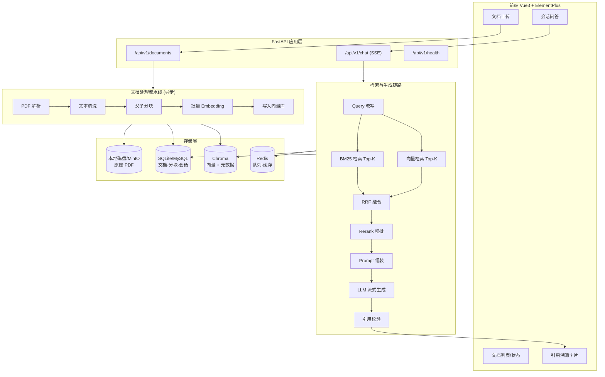
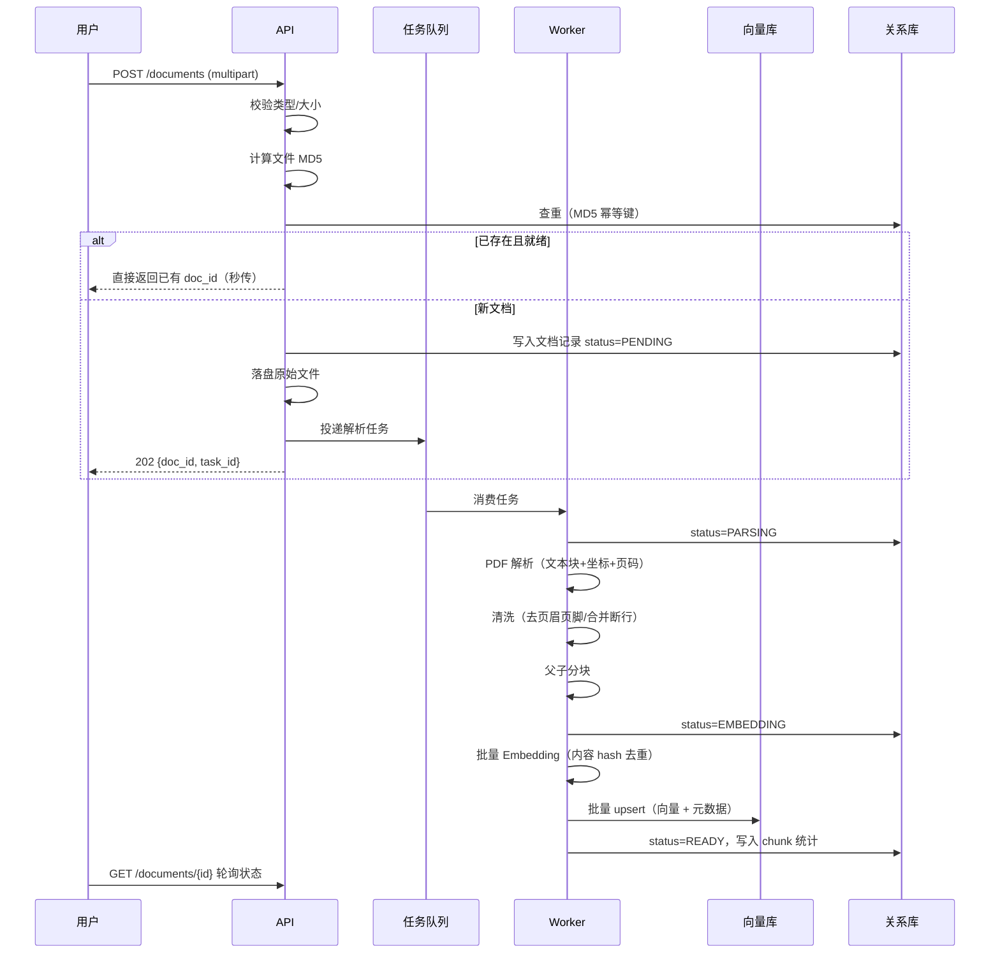
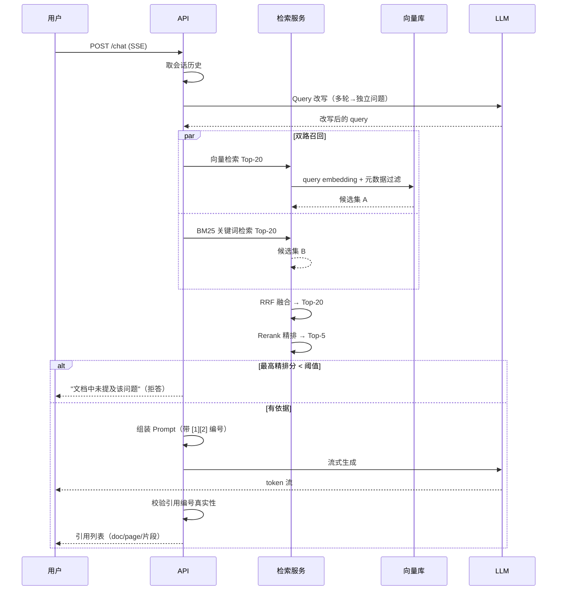

# DocMind 架构设计

> 本文档描述系统的整体架构、核心数据流与关键设计取舍。
> 面向两类读者：想快速理解代码结构的开发者，以及面试中需要被追问细节的评审者。

---

## 一、系统定位

DocMind 是一个**面向私有文档的检索增强生成（RAG）问答系统**。

解决的问题：企业/团队内部沉淀了大量 PDF 文档（产品手册、测试规范、设备说明、制度文件），
员工遇到问题时只能靠关键词搜索或翻页查找，效率低且容易漏。DocMind 让用户直接上传 PDF，
用自然语言提问，系统**基于文档原文**给出答案，并标注答案出自哪一页的哪一段。

核心约束（这些约束决定了后面所有设计）：

| 约束 | 推导出的设计决策 |
|---|---|
| 答案必须可追溯，不能编造 | 引用溯源 + 精排分数阈值拒答 + 服务端校验引用编号 |
| 文档是专业资料，含大量型号与数字 | 混合检索（向量 + BM25），纯向量对型号/数字召回差 |
| 单份文档可能上百页 | 父子块索引，避免"检索精度"与"上下文完整"二选一 |
| 大文件上传后解析耗时长 | 异步任务流水线，上传立即返回 task_id |
| 多用户数据必须隔离 | `user_id` 过滤条件下沉到向量库，而非应用层二次过滤 |

---

## 二、整体架构



---

## 三、核心数据流

### 3.1 文档入库链路（写路径）



**为什么用状态机而不是一个布尔值 `ready`**：
解析/向量化是长事务，中途可能失败。`PENDING/PARSING/EMBEDDING/READY/FAILED` 五态让
前端能给出精确的进度提示，也让失败任务可以定位到具体阶段重试，而不是整份重跑。

### 3.2 问答链路（读路径）



---

## 四、关键设计取舍

### 4.1 为什么要父子块（Small-to-Big）

**问题**：单一块大小是个两难。

- 块太大（如 1500 字）→ 向量被稀释，检索命中率下降
- 块太小（如 300 字）→ 检索准了，但喂给 LLM 的上下文缺前因后果，答案不完整

**方案**：索引时切两层。

```
父块 (1500 字, 按章节标题切)
├── 子块1 (300 字)  ← 生成 embedding，写入向量库
├── 子块2 (300 字)
└── 子块3 (300 字)

检索命中子块2 → 返回其父块全文给 LLM
```

子块携带 `parent_id` 元数据，命中后按 `parent_id` 去重合并，只把父块喂给 LLM。

**收益**：检索粒度和生成粒度解耦。同时因为父块去重，实际上下文长度反而比"直接塞 20 个块"更短。

### 4.2 为什么要混合检索 + RRF

**问题**：向量模型对**专有名词、型号、数字**不敏感。

例如查询「1333 机种钢刀的更换周期」：纯向量检索可能召回一堆"设备维护"相关但机种不对的段落。

**方案**：双路召回 + RRF（Reciprocal Rank Fusion）融合。

$$\text{RRF}(d) = \sum_{i \in \text{retrievers}} \frac{1}{k + \text{rank}_i(d)}$$

其中 $k$ 取 60。

**为什么用 RRF 而不是加权求和**：向量的余弦相似度（0~1）和 BM25 分数（0~20+）量纲完全不同，
加权求和需要先归一化，而归一化方式本身又是一个需要调参的坑。RRF **只用排名不用分数**，
对两路分数量纲不敏感，鲁棒性显著更好，且几乎不需要调参。

### 4.3 为什么要 Rerank

向量检索是**双塔模型**：query 和 document 分别编码，两者在编码时互不可见，
只有最后算内积时才交互。这决定了它快但精度有上限。

Rerank 是**交叉编码器**：把 (query, document) 拼在一起送进模型，能做 token 级交互，精度高得多，
代价是无法预计算、只能对少量候选集打分。

所以标准做法是：**召回用双塔（快，从全量到 20），精排用交叉编码器（准，从 20 到 5）**。

### 4.4 为什么精排分数能用来拒答

精排分数是 (query, passage) 对的相关性打分，且**分数在同一个 query 内可比**。
因此取 Top-1 的分数作为"这份文档到底有没有料"的判据，低于阈值就拒答。

这比让 LLM 自己判断"我知不知道"可靠得多 —— LLM 在被要求回答时天然倾向编造，
而交叉编码器没有这个倾向。

**注意**：这个阈值不能拍脑袋定，必须跑评测集看分数分布再定（见 `docs/05-评测方案.md`）。

---

## 五、分层与模块职责

```
backend/app/
├── main.py                 应用工厂 / 生命周期 / 全局异常处理
├── core/                   横切关注点（与业务无关，可整体复用）
│   ├── config.py           配置中心（pydantic-settings 强类型校验）
│   ├── logging.py          日志（trace_id 全链路贯穿）
│   ├── exceptions.py       异常体系（业务异常与 HTTP 状态码解耦）
│   ├── response.py         统一响应外壳
│   └── middleware.py       TraceId 注入 + 访问日志
├── api/
│   ├── router.py           路由聚合
│   ├── deps.py             依赖注入（DB session / 当前用户 / 分页）
│   └── v1/                 各业务路由
├── models/                 SQLAlchemy ORM 模型
├── schemas/                Pydantic 请求/响应模型（与 ORM 分离）
├── services/               业务逻辑（可被 API 和 Worker 共同调用）
│   ├── parser/             PDF 解析
│   ├── chunking/           分块策略
│   ├── embedding/          Embedding Provider 抽象
│   ├── vectorstore/        向量库抽象
│   ├── retrieval/          混合检索 + RRF + Rerank
│   ├── llm/                LLM Provider 抽象（流式）
│   └── rag/                链路编排
└── worker/                 异步任务定义
```

**分层原则**：`api` 只做参数校验和响应组装；业务逻辑全在 `services`；
`services` 不依赖 FastAPI，因此**同一份逻辑可以被 HTTP 接口和异步 Worker 复用**。

---

## 六、可观测性

RAG 系统"效果不好"是个极难定位的问题 —— 可能是解析漏了、分块切坏了、
召回没召到、还是 LLM 没用好？因此每一环都必须可观测。

| 层级 | 指标 | 采集方式 |
|---|---|---|
| 检索层 | 各阶段候选数、耗时 | `log_kv(logger, "retrieval.stage", ...)` |
| 检索层 | 向量/BM25 各自命中的 chunk_id | 调试模式下落盘，供评测脚本比对 |
| 生成层 | 首 token 延迟、总耗时、token 用量 | SSE 事件 + 日志 |
| 生成层 | 引用命中率（答案引用的编号是否真实存在） | 引用校验环节统计 |
| 业务层 | 拒答率、点踩率 | 反馈接口 + 数据库统计 |
| 链路层 | trace_id 贯穿全流程 | 中间件 + ContextVar |

**为什么 trace_id 值得单独做**：一次问答会经过改写 → 双路检索 → 融合 → 精排 → 生成
至少 5 个环节，跨 HTTP 请求和后台任务。没有统一 trace_id 时，日志是碎片化的，
排查一次线上问题要花十几分钟靠时间戳猜。这是低成本高回报的基础设施。
